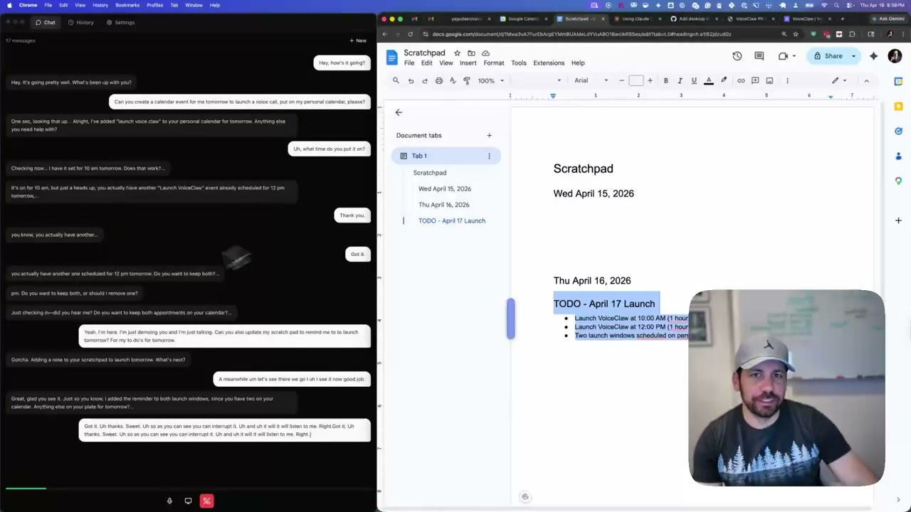
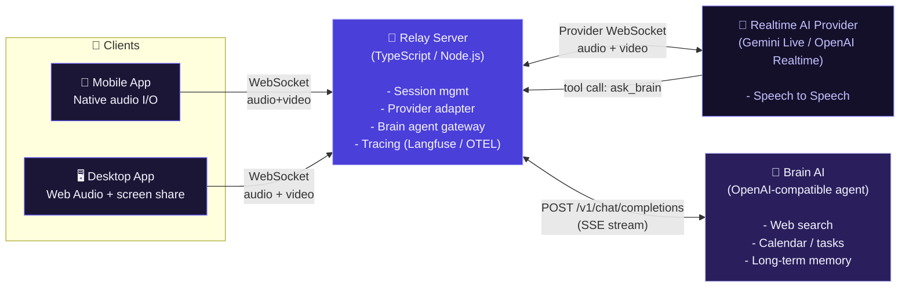

# VoiceClaw

[](LICENSE)
[](https://www.typescriptlang.org/)
[](https://nodejs.org/)
[]()
[]()
[]()
[]()
[](relay-server/Dockerfile)

Open-source voice AI assistant. Talk to any AI model in real time from your phone or desktop.

VoiceClaw is a **thin voice layer on top of your existing AI agent**. Already have an agent that can search the web, manage your calendar, or access your tools? VoiceClaw gives it a voice -- connect any OpenAI-compatible agent and talk to it naturally through your phone or desktop.

## Demo

Watch VoiceClaw in action as a thinking partner for real-time problem solving:

[](https://youtu.be/iAS7vj2vRaA?si=oelgIdETS8iWTavV)

**The magic of voice agents:** Talk through ideas with your AI agent while you work. Real collaboration, real thinking.

## How it works: the `ask_brain` pattern

Realtime voice models (Gemini Live, OpenAI Realtime) are great at natural conversation but can't use tools, access memory, or call external APIs on their own. VoiceClaw bridges this gap with a simple escalation pattern:

1. You speak to a **realtime voice model** that handles conversation naturally
2. When the model needs capabilities it doesn't have, it calls the `ask_brain` tool
3. The relay server routes `ask_brain` to **your existing agent** -- any OpenAI-compatible chat completions endpoint
4. Your agent does the heavy lifting (web search, memory lookup, tool execution) and streams results back
5. The voice model incorporates the answer and keeps talking

**Bring your own agent.** VoiceClaw doesn't ship a brain -- it connects to yours. Point it at [OpenClaw](https://github.com/yagudaev/openclaw), [Hermes](https://nousresearch.com/hermes), any MCP-based agent, or your own custom endpoint. If it speaks the OpenAI chat completions protocol, it works.

## Architecture



<details>
<summary>View as ASCII</summary>

```text
+------------------+        WebSocket         +----------------+        Streaming API       +------------------+
|                  | -----------------------> |                | -----------------------> |                  |
|   Mobile App     |    audio + events        |  Relay Server  |    audio + events        |  Realtime Voice  |
|   (Expo / iOS)   | <----------------------- |  (Node.js)     | <----------------------- |  (Gemini Live    |
|                  |                          |                |                          |   or OpenAI)     |
+------------------+                          |                |                          +------------------+
                                              |                |
+------------------+                          |  ask_brain     |        HTTP / SSE         +------------------+
|                  | -----------------------> |  --------------|-------------------------> |                  |
|   Desktop App    |    audio + events        |                |    OpenAI-compatible      |   Brain Agent    |
|   (Electron)     | <----------------------- |                |    chat completions       |   (any agent)    |
|                  |                          +----------------+                           +------------------+
+------------------+                                                                       OpenClaw, Hermes,
                                                                                           or your own agent
```

</details>

**Mobile app** -- React Native / Expo iOS app with voice capture and playback.
**Desktop app** -- Electron + React + Tailwind macOS app with screen sharing support.
**Relay server** -- TypeScript / Node.js WebSocket server that brokers sessions between clients and AI providers.
**Brain agent** -- Any OpenAI-compatible agent endpoint. The relay calls it via `ask_brain` when the voice model needs tools, memory, or external data. Swap in any agent you want.

## Quick Start

### Prerequisites

- Node.js 20+
- yarn

### 1. Clone the repo

```bash
git clone https://github.com/yagudaev/voiceclaw.git
cd voiceclaw
yarn install
```

### 2. Start the relay server

```bash
cd relay-server
cp .env.example .env
# Edit .env and add your API keys (see Configuration below)
yarn dev
```

The server starts on `http://localhost:8080` with a test page at `/test`.

### 3. Start the desktop app

```bash
cd desktop
yarn dev
```

### 4. Start the mobile app

```bash
cd mobile
yarn dev
```

Or use the root workspace scripts:

```bash
yarn dev:server     # relay server only
yarn dev:desktop    # desktop app only
yarn dev:mobile     # mobile app only
yarn dev            # mobile + web + server together
```

## Configuration

The relay server reads these environment variables from `relay-server/.env`:

| Variable | Required | Description |
|----------|----------|-------------|
| `GEMINI_API_KEY` | Yes (for Gemini provider) | Google Gemini API key for Live API |
| `OPENAI_API_KEY` | Yes (for OpenAI provider) | OpenAI API key for Realtime API |
| `RELAY_API_KEY` | Recommended | API key clients must send to connect. Generate with `openssl rand -hex 24` |
| `BRAIN_GATEWAY_AUTH_TOKEN` | Optional | Auth token for your brain agent endpoint |
| `BRAIN_GATEWAY_URL` | Optional | Brain agent URL -- any OpenAI-compatible endpoint (default: `http://localhost:18789`) |
| `PORT` | Optional | Server port (default: `8080`) |
| `LANGFUSE_PUBLIC_KEY` | Optional | Langfuse tracing public key |
| `LANGFUSE_SECRET_KEY` | Optional | Langfuse tracing secret key |
| `LANGFUSE_BASE_URL` | Optional | Langfuse endpoint (default: `https://cloud.langfuse.com`) |

You need at least one provider key (`OPENAI_API_KEY` or `GEMINI_API_KEY`) for the relay to be useful.

## Project Structure

```
voiceclaw/
  mobile/           React Native (Expo) iOS app
  desktop/          Electron + React + Tailwind macOS app
  relay-server/     TypeScript WebSocket relay server
  website/          Next.js marketing site
  agent/            Agent plugins and configuration
  package.json      Yarn workspaces root
```

## Contributing

1. Fork the repo and create a feature branch
2. Make your changes
3. Open a pull request against `main`

Please keep PRs focused -- one feature or fix per PR.

## License

[MIT](LICENSE)
