# VoiceClaw Architecture

## System Overview

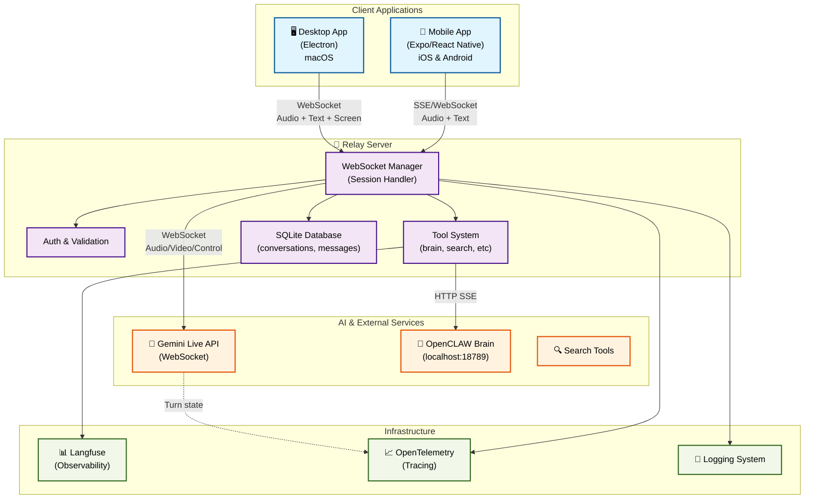

---

## Voice Interaction Flow (Turn-Based)

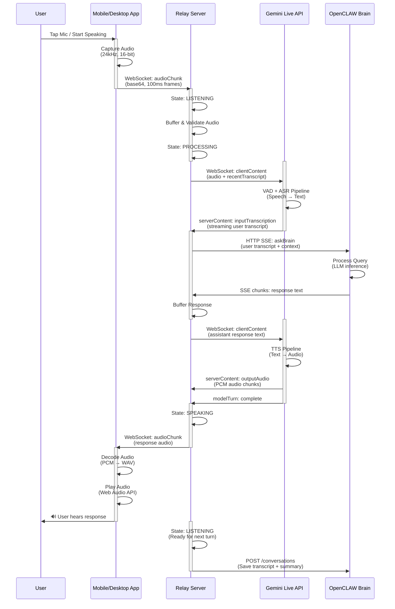

---

## Session Lifecycle

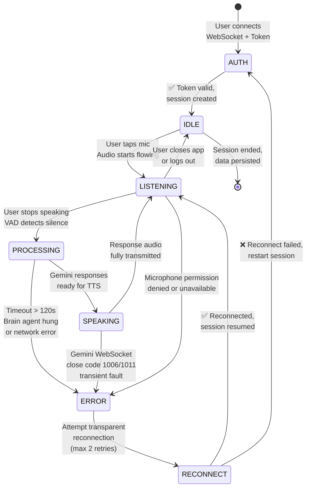

---

## Relay Server: Request Handling Pipeline

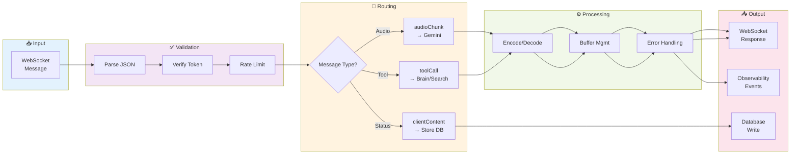

---

## Gemini Live API Integration Details

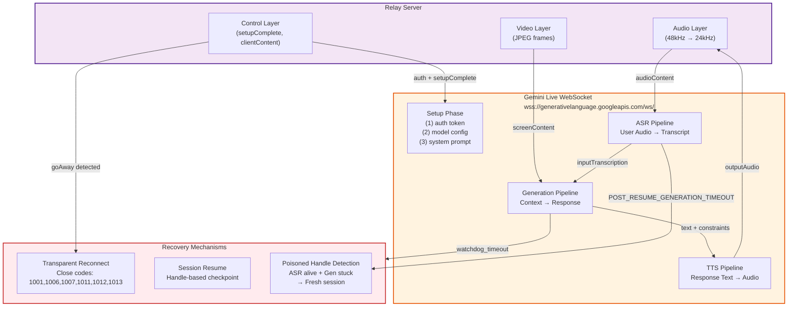

---

## Audio Pipeline: Desktop App (Electron)

```mermaid
graph LR
    subgraph capture["🎤 Capture"]
        A["Navigator.mediaDevices<br/>.getUserMedia"]
        B["AudioContext"]
        C["ScriptProcessor<br/>or AudioWorklet"]
    end

    subgraph process["⚙️ Processing"]
        D["High-Pass Filter<br/>(80 Hz)"]
        E["Notch Filter<br/>(60 Hz)"]
        F["RMS Computation<br/>for Level Meter"]
    end

    subgraph encode["📦 Encode"]
        G["Float32 → PCM<br/>(-32768 to 32767)"]
        H["Base64 Encode"]
        I["100ms Frame<br/>≈ 2400 samples"]
    end

    subgraph send["📤 Send"]
        J["WebSocket<br/>audioChunk"]
        K["to Relay Server"]
    end

    A --> B --> C --> D --> E --> F --> G --> H --> I --> J --> K

    subgraph playback["🔊 Playback"]
        L["Base64 Decode"]
        M["PCM → Float32"]
        N["Web Audio Playback<br/>Gain + Pan nodes"]
        O["Speaker Output"]
    end

    K -.->|"response audio<br/>from relay"| L --> M --> N --> O

    style capture fill:#e3f2fd,stroke:#01579b
    style process fill:#f1f8e9,stroke:#33691e
    style encode fill:#fff3e0,stroke:#e65100
    style send fill:#f3e5f5,stroke:#4a148c
    style playback fill:#fce4ec,stroke:#880e4f
```

---

## Mobile App (Expo/React Native) Architecture

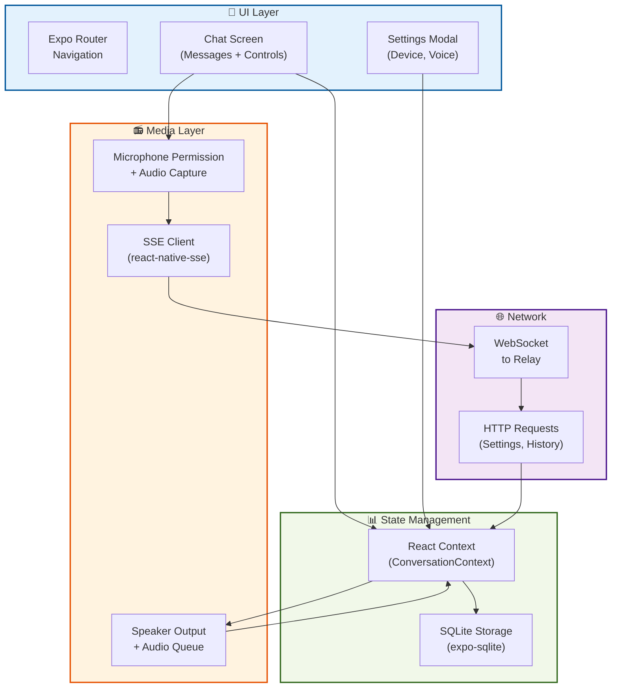

---

## Real-Time Observability: Turn State Tracing

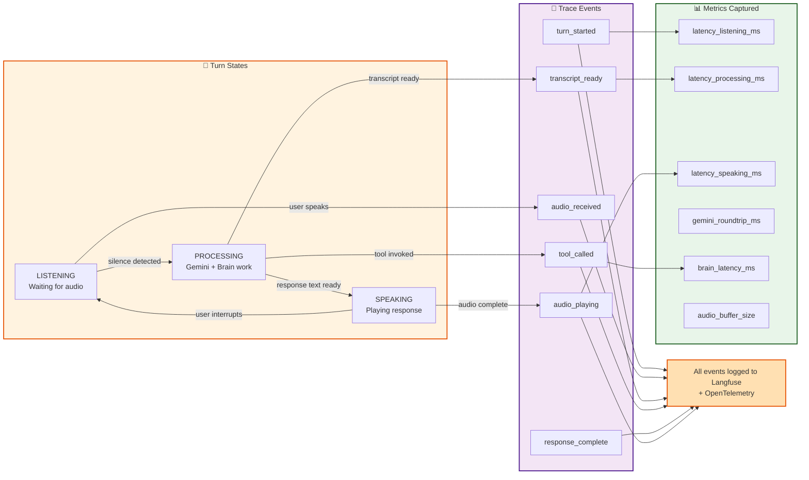

---

## Error Recovery: Poisoned Handle Detection

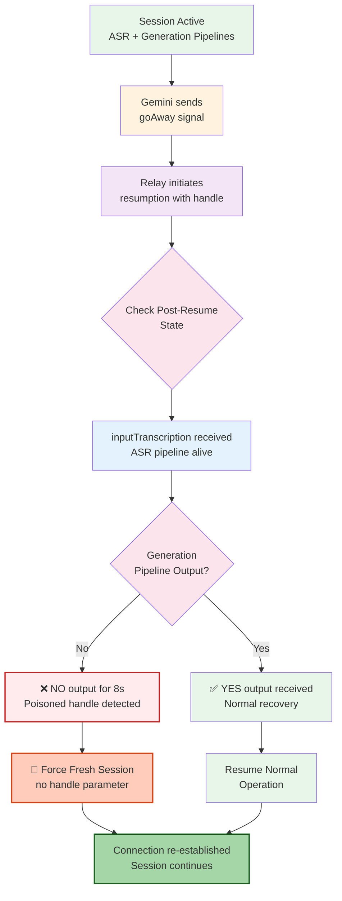

---

## Data Flow: Message Persistence

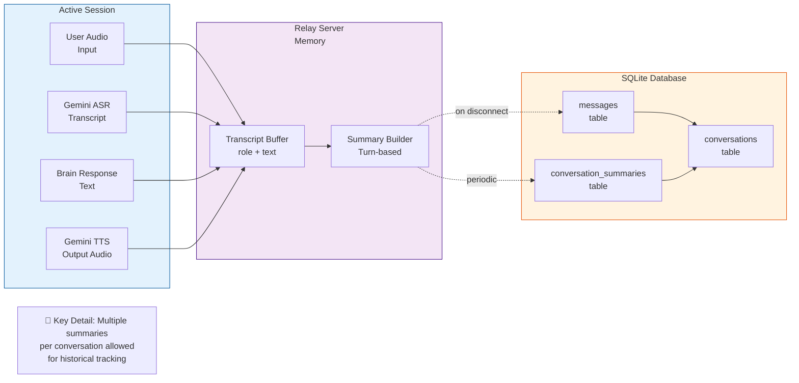

---

## Performance Targets & Latency Budgets

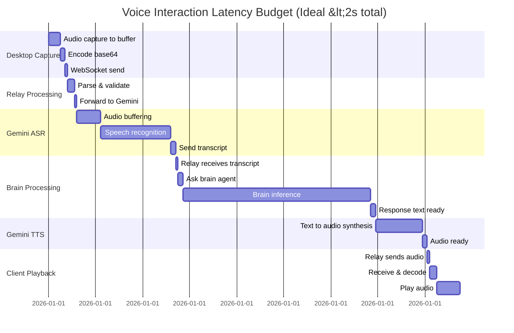

**Latency Breakdown:**
- **Ideal total**: ~1.6 seconds (user hears response)
- **Critical path**: ASR (300ms) + Brain (800ms) + TTS (200ms)
- **Tail latency** (p95): ~2.5s (network jitter + GC pauses)
- **Unacceptable** (>5s): Triggers "thinking" UI state

---

## Technology Stack Summary

| Component | Technology | Why |
|-----------|-----------|-----|
| **Relay Server** | Node.js + TypeScript + Express 5.1 | Fast async I/O, WebSocket-native |
| **Mobile** | Expo SDK 55 + React Native | iOS/Android code sharing, quick iteration |
| **Desktop** | Electron 41.2.1 + Vite + React 19 | Native app feel, access to microphone/screen |
| **Audio API** | Web Audio API (desktop), media-recorder-api (mobile) | Low-latency, cross-platform |
| **Database** | SQLite (desktop) + SQLite (mobile via expo-sqlite) | Local persistence, no network dependency |
| **AI Models** | Gemini 3.1 Flash Live + OpenCLAW Brain | Real-time voice, custom logic |
| **Observability** | Langfuse + OpenTelemetry | Turn-state tracing, performance monitoring |
| **Audio Filtering** | biquadjs (high-pass, notch) | Client-side noise reduction |

---

**Last Updated**: 2026-04-20
**Architecture Owner**: Michael Yagudaev
