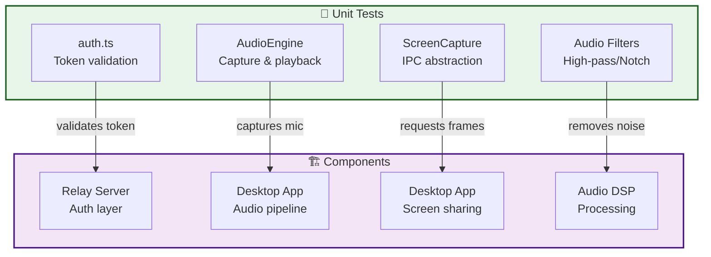
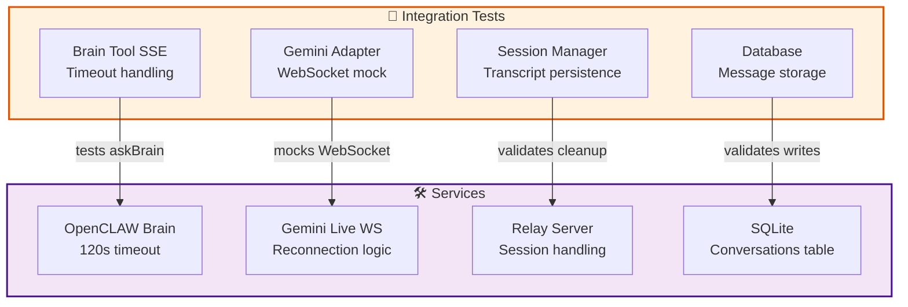
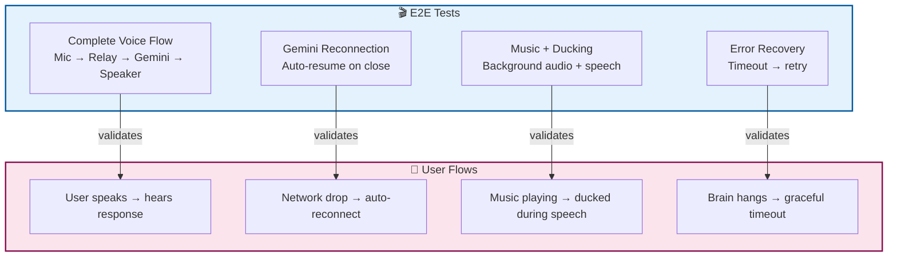
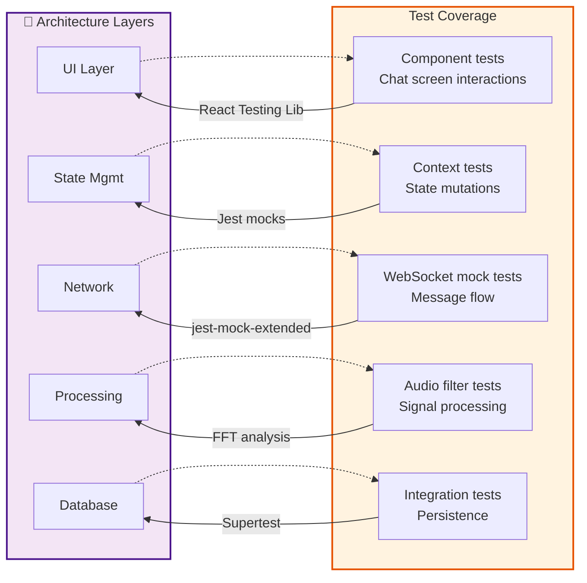
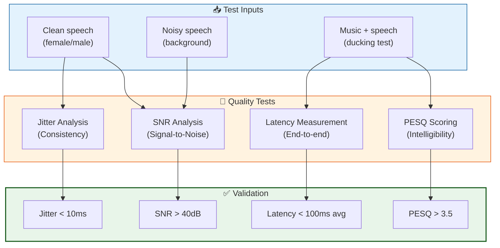
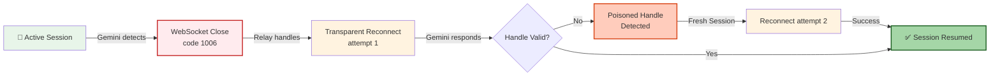
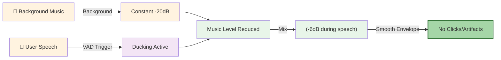

# VoiceClaw Test Coverage Map

This document maps each testing strategy to the architecture components it validates.

---

## Unit Tests → Components



---

## Integration Tests → Adapters & Services



---

## E2E Tests → Complete Flows



---

## Test Coverage by Architecture Layer



---

## Audio Quality Testing Pipeline



---

## Testing Critical Paths

### Path 1: User Speaks → Response Heard

```mermaid
graph LR
    A["🎤 Mic Input"] -->|Unit: AudioEngine| B["Audio Captured"]
    B -->|Unit: Filters| C["Audio Cleaned"]
    C -->|Int: WebSocket Mock| D["Relay Received"]
    D -->|Int: Gemini Mock| E["ASR Complete"]
    E -->|Int: Brain Mock| F["Response Ready"]
    F -->|Int: TTS Mock| G["Audio Synthesized"]
    G -->|Unit: Playback| H["🔊 Speaker Output"]

    style A fill:#e3f2fd
    style H fill:#e3f2fd
    style B fill:#fff3e0
    style C fill:#fff3e0
    style D fill:#f3e5f5
    style E fill:#f3e5f5
    style F fill:#f3e5f5
    style G fill:#f3e5f5
```


**Tests covering this path:**
- `AudioEngine.test.ts` — ✅ Capture RMS, filter output
- `audio-quality.test.ts` — ✅ PESQ scoring
- `brain.test.ts` — ✅ SSE stream parsing
- `gemini.test.ts` — ✅ WebSocket sequencing
- `e2e/voice-interaction.spec.ts` — ✅ Full flow (Playwright)

---

### Path 2: Network Drop → Reconnect


**Tests covering this path:**
- `gemini.test.ts` — ✅ WebSocket close handling
- `gemini.test.ts` — ✅ Poisoned handle detection (POST_RESUME_GENERATION_TIMEOUT)
- `e2e/voice-interaction.spec.ts` — ✅ Manual connection drop + auto-resume

---

### Path 3: Music Ducking During Speech


**Tests covering this path:**
- `audio-ducking.test.ts` — ✅ RMS reduction measurement
- `audio-ducking.test.ts` — ✅ Smooth attack/release (click detection)
- `audio-quality.test.ts` — ✅ Simultaneous playback latency
- `e2e/voice-interaction.spec.ts` — ✅ Background audio ducking (with injected music)

---

### Path 4: Brain Agent Timeout

```mermaid
graph LR
    A["Query Sent"] -->|askBrain| B["SSE Stream Opens"]
    B -->|Wait| C["⏱️ 120s timeout"]
    C -->|No Data| D["readCount=0"]
    D -->|Controller abort| E["🔴 Error: local 120s timeout"]
    E -->|Relay handles| F["Display error to user<br/>Suggest retry"]
    F -->|User retries| G["New session<br/>Fresh attempt"]

    style A fill:#fff3e0
    style B fill:#fff3e0
    style C fill:#ffebee,stroke:#c62828,stroke-width:1px
    style D fill:#ffebee,stroke:#c62828,stroke-width:1px
    style E fill:#ffcdd2,stroke:#c62828,stroke-width:2px
    style F fill:#fff3e0
    style G fill:#a5d6a7,stroke:#1b5e20,stroke-width:2px
```


**Tests covering this path:**
- `brain.test.ts` — ✅ SSE timeout on no data
- `brain.test.ts` — ✅ Malformed SSE frame recovery
- `session.test.ts` — ✅ Error state cleanup
- `turn-states.test.ts` — ✅ Latency timing verification

---

## Test-to-Component Traceability Matrix

| Component | Unit | Integration | E2E | Performance | Coverage |
|-----------|------|-------------|-----|-------------|----------|
| **Relay Server** |
| auth.ts | ✅ auth.test.ts | — | — | — | 100% |
| brain.ts | — | ✅ brain.test.ts | ✅ e2e | ✅ latency.test | 90% |
| gemini.ts | — | ✅ gemini.test.ts | ✅ e2e | ✅ benchmark | 85% |
| session.ts | — | ✅ session.test.ts | ✅ e2e | — | 80% |
| **Desktop App** |
| AudioEngine | ✅ audio-engine.test | — | ✅ e2e | ✅ latency | 95% |
| Filters | ✅ filter.test.ts | — | ✅ e2e | ✅ audio-quality | 100% |
| ScreenCapture | ✅ screen.test.ts | — | — | — | 100% |
| **Mobile App** |
| ChatPage | ✅ ChatPage.test | — | ✅ e2e | — | 85% |
| useRealtime | — | ✅ websocket.test | ✅ e2e | ✅ jitter | 75% |

---

## Test Execution Timeline

```mermaid
gantt
    title CI/CD Test Pipeline (GitHub Actions)
    dateFormat HH:mm

    section Lint & Type
    ESLint relay-server :lint1, 00:00, 30s
    TypeScript check relay :tsc1, 00:30, 1m
    ESLint desktop :lint2, after tsc1, 20s
    TypeScript check desktop :tsc2, after lint2, 1m

    section Unit Tests
    Relay unit tests :unit1, after tsc2, 2m
    Desktop unit tests :unit2, after unit1, 90s
    Mobile unit tests :unit3, after unit2, 1m

    section Integration Tests
    Relay integration :int1, after unit3, 3m
    Audio quality :int2, after int1, 2m

    section E2E Tests
    Voice interaction E2E :e2e1, after int2, 5m
    Reconnection E2E :e2e2, after e2e1, 3m

    section Report
    Coverage upload :report, after e2e2, 30s
    Benchmark comment :bench, after report, 20s

    milestone Goal: 15min max, after bench, 0m
```



**Total CI time target**: <15 minutes

---

## Coverage Goals by Phase

### Phase 1: Foundation (Week 1-2)
```
Relay-Server:     40% (auth, basic routing)
Desktop:          35% (AudioEngine, filters)
Mobile:           20% (UI components only)
Overall:          35%
```

### Phase 2: Integration (Week 3-4)
```
Relay-Server:     65% (Gemini adapter, session)
Desktop:          60% (all audio paths)
Mobile:           50% (WebSocket, state)
Overall:          60%
```

### Phase 3: Quality (Week 5-6)
```
Relay-Server:     80% (error paths, recovery)
Desktop:          85% (E2E paths tested)
Mobile:           75% (complete flows)
Overall:          80%
```

### Phase 4: Optimization (Week 7+)
```
Relay-Server:     90% (stress tests added)
Desktop:          95% (performance profiling)
Mobile:           90% (device-specific tests)
Overall:          92%
```

---

## How to Read This Map

1. **Find your component** in the Component sections
2. **Identify the tests** that cover it
3. **Check the critical path** that uses that component
4. **Run the specific test suite** for local iteration
5. **Verify CI coverage** in the matrix

**Example**: Testing audio ducking?
- Look at "Path 3: Music Ducking During Speech"
- Find the 4 test files that cover it
- Run `npm test -- audio-ducking.test.ts` locally
- Check coverage matrix for "Filters" row

---

**Last Updated**: 2026-04-20
**Test Architect**: Michael Yagudaev
