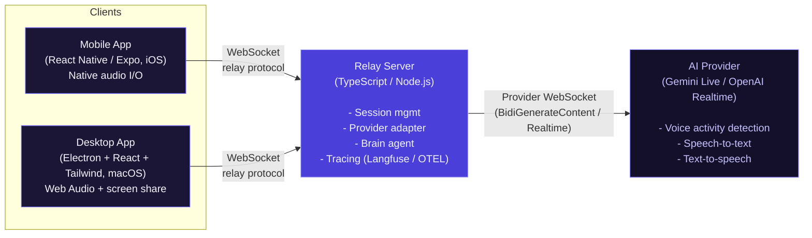
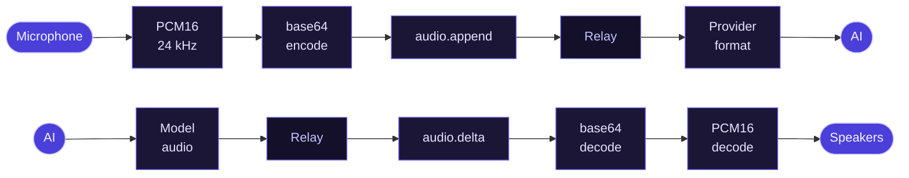
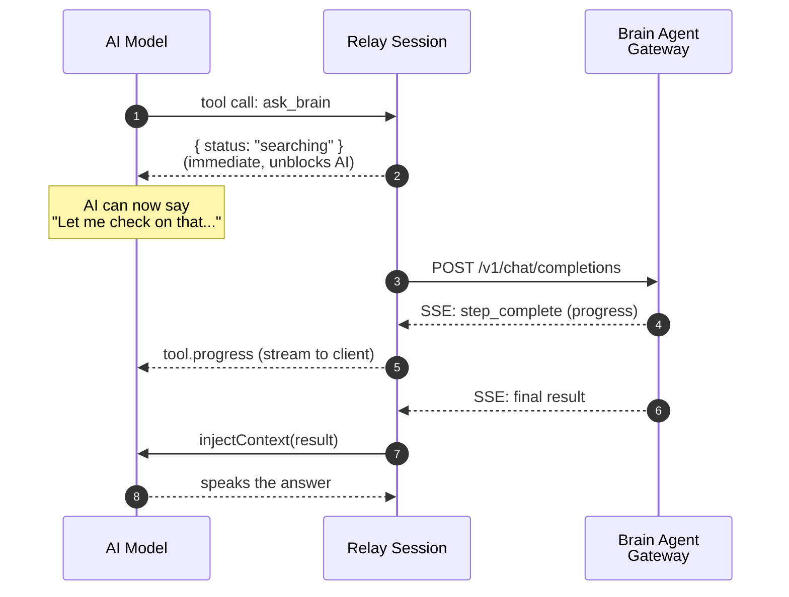

import { Aside } from '@astrojs/starlight/components'

VoiceClaw is a three-tier system: clients (mobile/desktop) talk to a relay server over WebSocket, and the relay server talks to AI providers (Gemini Live, OpenAI Realtime) over their native WebSocket APIs.

## System Overview

*[Edit this diagram ↗](https://mermaid.live/edit#pako:eNqdlG9v2jAQxr_KyX1D1TDKylAXTZXoH1WVWJkK2qSNvTD2BTwS27INLav63XfESQh7M2m8COez_bvnnovyyoSRyFKW5eZZrLgLMH6aa6Cf3yyWjtsV3OQKdfA_5qyK5uxnPAIglUMRlNEwu65zn81C5UjHYwAjaz8tXO-q84RcBHjkQW0RenD3Yk0CajI9LberPN9IZeChN2lVuUW_DsYSsooOzLuc6juqfwYRfwYzrvJnpWUCBRc1_RsuYFSiz8ALh6jBU7vYVEEt5zqGT5jzHRUr_2GKbosuVpvtLE6FUzaQ_kdy7t0vH_nlo0uHvd-7USyLUKW-OLNVEh1wyW2oSF24dlxp4EsytMrMHBdKL6Ez5nqZbfzeo8nsbnxaaozSahipGz00qyjuHgulFYyjuxOLmo6QKXlQBR6p_GqUIKdpcFsVdiAxxCHWTVhEseoG0w340qijcJ_y5WZLUjXlbhfmjFyeGrHGeMmV_llnghEmnzM6cxXNjTfrYf7H1Tia8mLj7zGhc62kukeNjge8MTqQ0WRL40fFrG_X3Yice3-LGQX7d30adtRbpvI8PemL_vBimHh63daYngzF8CLLEpJnXHqSfcho9Rej7KKNGPCLTH5sEGIg-v9A2ErfkZBB__w9byiXi8vBgRKZLUo1oKR2u9VY-1R09KC4vddYfKSGJaxAV3AlWfrKwgqL_YdEcrdmbwnjm2CmOy1YGtwGE7axkgZxqzh9VIo6abn-bkx7uUe9sPQ8YTt6Eud3ud9_-wMH_Yvl)*

## Audio Flow

All audio travels as **PCM16 at 24kHz**, base64-encoded over WebSocket JSON messages.

### Client to Provider

1. Client captures microphone audio (24kHz PCM16, mono)
2. Client sends `audio.append` messages with base64 data
3. Relay forwards to provider:
   - **Gemini**: downsampled to 16kHz (Gemini requires 16kHz), sent as `realtimeInput.audio`
   - **OpenAI**: forwarded at 24kHz as `input_audio_buffer.append`
4. Provider runs voice activity detection (VAD) to determine speech boundaries

### Provider to Client

1. Provider generates speech audio
2. Relay receives audio and sends `audio.delta` messages to client
3. Client decodes base64 PCM16 and plays through speakers
4. On barge-in (user starts talking), client receives `turn.started` and stops playback

*[Edit this diagram ↗](https://mermaid.live/edit#pako:eNptU2FvmzAQ_SvI-bJK7lYIRR2qKqWLpkZapCr51mUfjH1uUAxGxmmXVv3v9ZlgSDYkMOd7PL97d7wTrgWQnEilX_mWGRv9Wm3qyF3Lkn_5vSFuMbrZ6ho25M9FdHl5Fz3-WMYug0t2W5hvd0ka7R7eXL77EhMeeJ-lzAEL1kKWeiTUeF5AIsAjZ00DtXBYthel_sp8GGBd1gNXoNgBT_cvAdFtd-qMfikFmJ-VRZHHyJ8utamYHXQOyE7EIsaKZwusdFMfz14kw6aHLV0FaoY60R4MPLlXHrgH0CA7-b_sxCPmoCwLBgiMAsznekeLU0cFnDta9E1KTpp0BsS8B64bYDswLVbZv48N4Iq17RxkJOBlbQ8KIlkqlU9SNpXiO22t0TvIJzzlsZSUa6VNPpHXcirlGUFroRkzxDzOpllgyHg2HRggg38ZDPp1QpHGVwkLFDfFTTpQdJJGFDjTtK-Runa7Owl1jYFoG0WLKI4oPgraTSH1zaCj2aGjXocSx2TdcNJjs4caCCUVuIksBcnfid1ChX-iYGZHPqgbBKvXh5qT3Jo9ULJvBLMwL9mzYVW_2bD6SetxiFR_SX5FycE9Hc-bz8cfn97oO5Q)*

## Video / Screen Sharing Flow

The desktop app can share screen content with the AI (Gemini only -- OpenAI Realtime does not support video input).

1. User picks a screen source via Electron's `desktopCapturer`
2. `ScreenCapture` grabs frames at **1 FPS**
3. Frames are resized to fit within 768px (preserving aspect ratio)
4. Exported as JPEG at 70% quality, base64 encoded
5. Sent as `frame.append` messages over the relay protocol
6. Relay forwards to Gemini as `realtimeInput.video`

<Aside type="note">
Screen frames do not reset the watchdog timer -- only audio activity counts as user presence.
</Aside>

## Session Lifecycle

### Connection

1. Client opens WebSocket to `ws://<relay>:8080/ws`
2. Client sends `session.config` with provider, model, voice, API key, and options
3. Relay validates the API key against `RELAY_API_KEY`
4. Relay creates a provider adapter (Gemini or OpenAI) and connects upstream
5. Relay sends `session.ready` back to client

### Conversation

1. Client streams audio via `audio.append`
2. Provider detects speech and generates responses
3. Relay forwards audio (`audio.delta`), transcripts (`transcript.delta`/`transcript.done`), and turn signals (`turn.started`/`turn.ended`)
4. If the AI calls a tool, relay sends `tool.call` to client (or handles it server-side for `echo_tool` and `ask_brain`)

### Session Rotation

Long-running sessions need periodic rotation to avoid provider timeouts:

- **Gemini**: uses session resumption handles. On `goAway`, the relay reconnects with the stored handle. The conversation continues transparently. Audio and control messages are queued during reconnect.
- **OpenAI**: uses timer-based rotation (default 50 minutes). The relay summarizes the transcript, closes the old connection, opens a new one with the summary injected into instructions.

Both emit `session.rotating` / `session.rotated` so clients can handle the transition (clear audio buffers, show status).

### Disconnection

1. Client closes WebSocket (or connection drops)
2. Relay session cleanup runs:
   - Aborts all in-flight tool calls
   - Ends the Langfuse tracing session
   - Syncs conversation transcript to the brain agent for long-term memory
   - Disconnects the provider adapter

## Brain Agent

The brain agent gives the voice AI capabilities beyond conversation -- web search, calendar, tasks, memory, and more. It runs as an async background process.

*[Edit this diagram ↗](https://mermaid.live/edit#pako:eNptkttqGzEQhl9l0JUNa7u5FcVgpyEYeqLbq7IQxtqprVqHrTQbZ2v87h15nRCa6kKgmX8-5h_NSZnYktIq0--egqEPFncJfRNADvYcQ--3lMZ3h4mtsR0GhtUGMJf7kwDc23xd0t_I4QA15WxjeKtZF806oQ2w2lHg99u0WN4j0xGH5qpfbWbLZa2BY3Rg0DktRYeHbakaFfVMFKuNhhNkRu6zhkb8YDJ7G3aNgvOFO7HeU2uFXkEfti6aQ-l_OkI-RyaIj5SgkMSWwQAhHiHjcClv1Edi8ARmT-YAMQDvkefzeaOal0aWy7WGr1_q77B4vFkYESxM9J0jFv95VK1no6G6vtPSMHUPVwnBpEtxl2Ra03-cFfPz5yRMMidCL1Ewzsrcpv8h_7QBHYi-d_y6wYKz4RcZvo2B6Ykno2b6Mu4RkjtCGRDvCTDkIyVVKU_Jo22VPimJ-7I3LaaDOleqrEo9BKM0p54q1XetTPq6Tc9B-fQfMb5-FtST0u8qNcgtnD-X_M35L4QR194)*

Key design decisions:
- The initial `ask_brain` tool result is returned immediately with `{"status": "searching"}` so the AI can say something like "Let me check on that..." while the brain works
- Progress events (`tool.progress`) stream to the client for live UI updates
- The final result is injected back via `injectContext()` rather than as a tool result, because the AI has already moved past the tool call
- Brain calls are cancellable -- if the AI model cancels the tool call (e.g., user changed topic), the in-flight HTTP request is aborted
- On session disconnect, the full transcript is synced to the brain with retry logic so the agent remembers the conversation

## Tracing

The relay server integrates with [Langfuse](https://langfuse.com) via OpenTelemetry for observability:

- Each session is a Langfuse trace
- Each conversation turn is a generation span with token/audio usage
- Tool calls are nested spans within turns
- Client timing events (`client.timing`) attach latency metrics (e.g., time to first audio)
- Usage metrics from providers are forwarded to Langfuse for cost tracking
