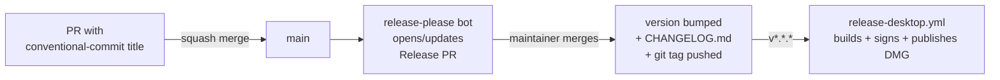

import { Aside, Steps } from '@astrojs/starlight/components'

VoiceClaw uses [release-please](https://github.com/googleapis/release-please) to version its packages and maintain a changelog. You never hand-bump a `version` field or hand-write a changelog entry — release-please does both, driven entirely by your PR titles.

This page is the **contributor** view: how your PR title turns into a version bump. For the maintainer view — what happens after the tag fires, signing, notarizing, publishing the DMG — see [Releasing the desktop app](/voiceclaw/desktop/releasing/).

## The flow in one picture



## Conventional Commits taxonomy

Your PR title is what release-please reads (we squash-merge, so the PR title becomes the single commit on main). The `commitlint-pr-title` workflow blocks PRs whose titles don't match.

| Prefix | Semver effect | Lands in changelog | Example |
| :-- | :-- | :-- | :-- |
| `feat:` | **minor** bump | Yes, under **Features** | `feat: add /download page` |
| `fix:` | **patch** bump | Yes, under **Bug Fixes** | `fix: correct DMG blockmap path` |
| `perf:` | patch bump | Yes, under **Performance** | `perf: cache audio-worklet init` |
| `refactor:` | patch bump | Yes, under **Code Refactoring** | `refactor: split relay handlers` |
| `revert:` | patch bump | Yes, under **Reverts** | `revert: disable auto-updater` |
| `docs:` | patch bump | Yes, under **Documentation** | `docs: document AEC tap fix` |
| `build:` | no bump | Hidden | `build: bump electron to 41.3` |
| `ci:` | no bump | Hidden | `ci: pin macos-14 runner` |
| `test:` | no bump | Hidden | `test: cover rotation retry` |
| `style:` | no bump | Hidden | `style: format with prettier` |
| `chore:` | no bump | Hidden | `chore: update yarn.lock` |

<Aside type="note">
A `!` after the prefix (for example `feat!: drop macOS 13 support`) signals a **breaking change** and forces a **major** bump. You can also use a `BREAKING CHANGE:` footer in the PR body.
</Aside>

### Scoping a commit to a package

release-please is configured in **manifest mode** — each package versions independently. The release-please bot figures out which package(s) a PR touched from the files it modified, so in almost all cases you don't need a scope in the title.

If you touched multiple packages in one PR and want to be explicit, you can use Conventional-Commit scopes:

```
feat(desktop): add auto-update checker
fix(website): correct /download status code
```

## The release PR flow

<Steps>

1. **Merge your PR** with a conventional-commit title.

2. Within a minute, the `release-please.yml` workflow opens (or updates) a **Release PR** titled something like `chore: release main`. It lists every unreleased change since the last tag, grouped by package and by type.

3. **Review the release PR.** It edits `package.json` versions, appends to each package's `CHANGELOG.md`, and updates `.release-please-manifest.json`. No code changes.

4. **Merge the release PR** when you're ready to cut a release. release-please then:
   - Pushes a git tag per bumped package (see [tag scheme](#tag-scheme) below).
   - Creates a GitHub Release for each tag with the changelog body.

5. For desktop releases: the `v*.*.*` tag push triggers [`release-desktop.yml`](https://github.com/yagudaev/voiceclaw/blob/main/.github/workflows/release-desktop.yml), which builds, signs, notarizes, and attaches the DMG to the same GitHub Release. See [Releasing the desktop app](/voiceclaw/desktop/releasing/) for that half of the story.

</Steps>

## Tag scheme

Each package produces its own tag when it bumps. This lets the desktop release pipeline react to desktop bumps only, and keeps website/docs noise out of the desktop build queue.

| Package | Tag format | Triggers |
| :-- | :-- | :-- |
| `desktop` | `v0.1.0`, `v0.1.1`, … | [`release-desktop.yml`](https://github.com/yagudaev/voiceclaw/blob/main/.github/workflows/release-desktop.yml) |
| `mobile` | `mobile-v1.1.0`, … | None today (App Store submissions are still manual via EAS) |
| `website` | `website-v0.1.1`, … | None today |
| `docs` | `docs-v0.0.2`, … | None today (docs deploy on every push) |

<Aside type="tip">
Desktop uses the bare `v{version}` scheme (via `include-component-in-tag: false`) specifically so `release-desktop.yml` can match a simple `v*.*.*` tag filter. Don't change this without updating the filter in both places.
</Aside>

## Manual overrides

### Force a specific version

Add a `Release-As:` footer to the PR body when you want to override the auto-computed version. Common when cutting a `1.0.0` milestone:

```
feat: freeze public API for 1.0

Release-As: 1.0.0
```

### Skip a release

Add `Release-As: skip` to pause releases from that commit, or simply don't merge the release PR until you're ready.

### Pre-releases

Add a prerelease suffix via `Release-As: 0.2.0-beta.1`. release-please will continue bumping the `-beta.N` segment on subsequent prereleases.

### Empty release (re-run the DMG build)

If notarization fails and you want to re-run the desktop workflow against an existing tag, use the `workflow_dispatch` trigger on `release-desktop.yml` directly — don't create an empty release PR.

## Starting state

This repo was bootstrapped with release-please at:

- `desktop@0.1.0`
- `mobile@1.0.0`
- `website@0.1.0`
- `docs@0.0.1`

The next `feat:` PR that lands will produce `desktop@0.2.0`; the next `fix:` PR will produce `desktop@0.1.1`. Same pattern per-package for website/docs/mobile.

## Why release-please (and not X)?

We picked release-please over alternatives for three reasons:

- **No local tooling.** Everything runs in GitHub Actions. Contributors don't need husky, commitlint hooks, or a changeset CLI installed.
- **Manifest mode supports our layout.** Each app package versions independently, which matches how they actually ship (desktop on tag, mobile via EAS, website continuously).
- **First-party integration with GitHub Releases.** The tag, the release, and the changelog are all produced in one step, which is what `release-desktop.yml` needs to attach artifacts.

We considered Changesets (better for npm-published libraries, overkill here) and semantic-release (more config, no manifest mode for monorepos without custom plugins).
