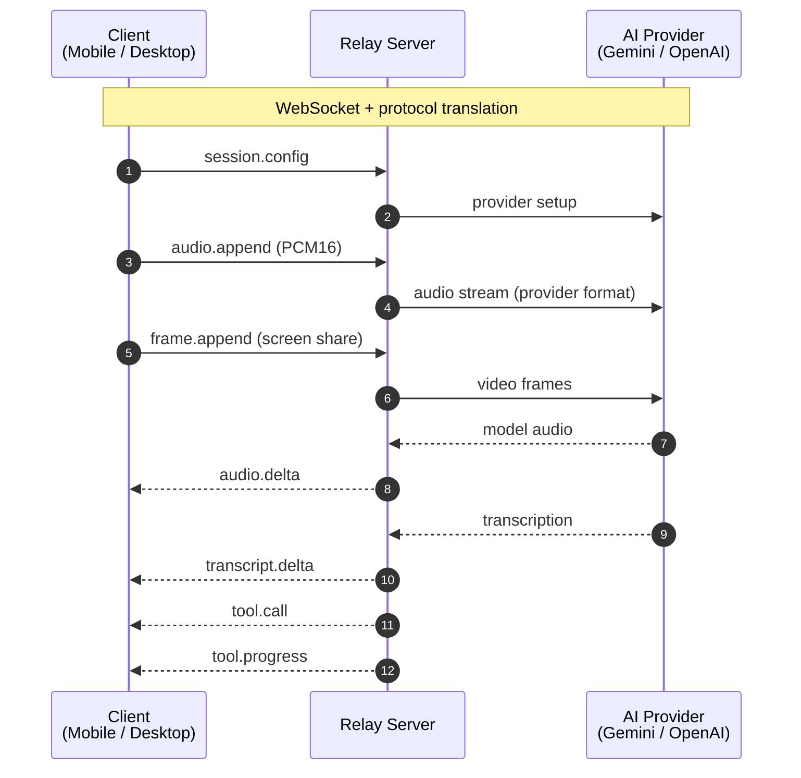

import { Card, CardGrid, Steps, Tabs, TabItem } from '@astrojs/starlight/components'

## Key Features

<CardGrid>
  <Card title="Real-time voice conversations" icon="comment-alt">
    Speak naturally and hear AI responses with low latency.
    Full-duplex audio with barge-in support -- interrupt the AI mid-sentence just like a real conversation.
  </Card>
  <Card title="Multi-provider support" icon="random">
    Switch between Gemini and OpenAI models without changing client code.
    The relay server handles protocol translation transparently.
  </Card>
  <Card title="Brain agent" icon="magnifier">
    An async tool-calling agent that gives the voice AI access to web search, calendars, tasks, memory, and more -- powered by any OpenAI-compatible agent.
  </Card>
  <Card title="Screen sharing" icon="laptop">
    Share your screen on desktop so the AI can see what you see.
    JPEG frames streamed at 1 FPS with context window compression.
  </Card>
  <Card title="Session resumption" icon="approve-check-circle">
    Gemini sessions survive network drops and transparently reconnect.
    OpenAI sessions rotate with transcript summaries to maintain context.
  </Card>
  <Card title="Conversation history" icon="list-format">
    Local SQLite storage on both mobile and desktop with full transcript search and conversation continuity.
  </Card>
</CardGrid>

## Components

<CardGrid>
  <Card title="Relay Server" icon="setting">
    TypeScript / Node.js WebSocket relay that translates between clients and AI providers.
    Handles brain agent calls, session management, and observability via Langfuse.

    [Read the docs](/voiceclaw/relay-server/)
  </Card>
  <Card title="Desktop App" icon="laptop">
    Electron + React + Tailwind macOS voice assistant with screen sharing capabilities.

    [Read the docs](/voiceclaw/desktop-app/)
  </Card>
  <Card title="Mobile App" icon="star">
    React Native / Expo iOS voice assistant with native audio I/O and conversation history.

    [Read the docs](/voiceclaw/mobile-app/)
  </Card>
</CardGrid>

## Quick Start

<Steps>
1. **Clone and install**

   ```bash
   git clone https://github.com/yagudaev/voiceclaw.git
   cd voiceclaw
   yarn install
   ```

2. **Start the relay server**

   ```bash
   cd relay-server
   cp .env.example .env    # add your API keys
   yarn dev
   ```

3. **Start a client**

   <Tabs>
     <TabItem label="Desktop">
       ```bash
       cd desktop
       yarn dev
       ```
     </TabItem>
     <TabItem label="Mobile">
       ```bash
       cd mobile
       yarn dev
       ```
     </TabItem>
   </Tabs>
</Steps>

## How It Works



*[Edit this diagram ↗](https://mermaid.live/edit#pako:eNptkkFP6zAMx7-KldMmyoALh-pp0lQkxAGotgPS07t4qTeipXFIUsRAfHfc5XWsghwixX__f04cfyjNDalSRXrpyGm6MbgN2P5zIAu7xK5r1xTy2WNIRhuPLkEFGKGyhlz6sw4X88k9r40luIAbirvEfvrTs-w9S7K4hxWF19-wdZ-yuIM68KtpKGT2LbXGGWE_enKLO0Fn5wMnAhYQVEVdwhOtV6x3lOAMfODEmi2kgC5aTIbdYKvO5_NlCZFilOhMs9uYbZaWIgnJ_y8vOanzIxd2jeEZerlJA5O6ur-6no68hwSIKRC2MDmSNhxaTNMRayOtpiMr6kDkID5joDGyJ3DOjlmozzOhle-zueTgEKEariliwrHj0A8djM8dOfV8S6fGo8psZxqt_SUsr9wGaacqVEvyTtOo8kOlZ2r74Wow7NRnofp5Wu2dVmUKHRWq8w2mYeSGoIzBX-bTY496U-VlofayC-f9oF99fgHA2-Kj)*

The relay server sits between clients and AI providers. It normalizes the different provider protocols into a single, clean WebSocket API. Clients never talk directly to Gemini or OpenAI -- they speak the relay protocol, and the relay handles the translation.

## Learn More

- [Architecture](/voiceclaw/architecture/) -- detailed system design, audio flow, and session lifecycle
- [Relay Server](/voiceclaw/relay-server/) -- WebSocket protocol reference, configuration, and brain agent
- [Desktop App](/voiceclaw/desktop-app/) -- building from source, screen sharing, and settings
- [Mobile App](/voiceclaw/mobile-app/) -- Expo build setup and iOS-specific notes
- [Contributing](/voiceclaw/contributing/) -- development setup, code style, and branch strategy
